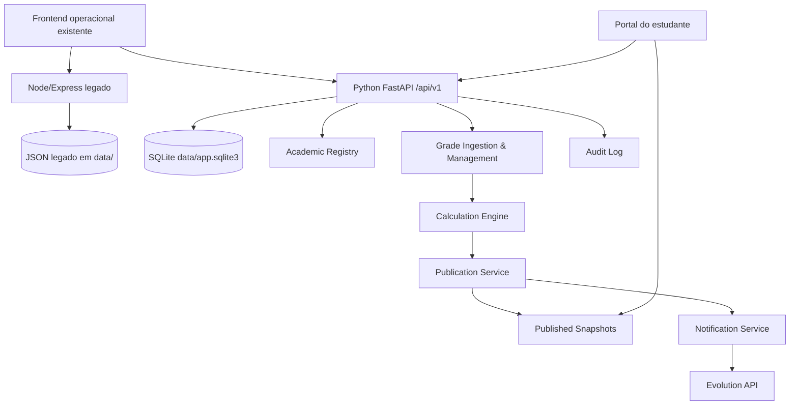

# Arquitectura Brownfield de Melhoria — Planilha de Notas de Alunos IA

## Introdução

Este documento define a arquitectura formal brownfield para evoluir o MVP local de upload, match e envio WhatsApp para uma plataforma académica com backend principal em Python, base de dados relacional local, autenticação por papéis, publicação controlada e portal do estudante.

O objectivo é orientar desenvolvimento assistido por IA sem quebrar o fluxo MVP já existente: upload de estudantes, upload de notas, geração de match, ligação Evolution, envio em massa e modo `dryRun`.

**Relação com a arquitectura existente:** este documento passa a ser o artefacto decisório principal para o Epic 5. Os documentos `docs/architecture/index.md` e `docs/architecture/system-architecture.md` continuam válidos como contexto, inventário histórico e visão resumida, mas decisões técnicas novas devem seguir este ficheiro quando houver divergência.

### Análise do Projecto Existente

#### Estado Actual do Projecto

- **Finalidade principal:** MVP local para importar estudantes e notas por CSV, gerar correspondência e enviar mensagens WhatsApp por Evolution API.
- **Stack actual:** Node.js, Express 4, JavaScript CommonJS, frontend estático em `public/`, Jest, Supertest, ESLint flat config e TypeScript checker por `tsc --noEmit`.
- **Estilo de arquitectura:** monólito local com separação simples entre rotas (`src/routes`), serviços (`src/services`) e UI estática (`public`).
- **Persistência actual:** ficheiros JSON em `data/`, nomeadamente `students.json`, `grades-last-upload.json` e `match-last.json`.
- **Integração externa actual:** Evolution API via HTTP, configurada por `EVOLUTION_BASE_URL`, `EVOLUTION_API_KEY`, `EVOLUTION_INSTANCE` e `EVOLUTION_INTEGRATION`.
- **Execução actual:** `npm run dev` ou `npm start`; Docker Compose apenas para Evolution API.

#### Documentação Disponível

- `docs/prd.md` e `docs/prd/index.md` definem a melhoria maior e os requisitos do Epic 5.
- `docs/architecture/index.md` e `docs/architecture/system-architecture.md` registam visão alvo, módulos lógicos e avaliação histórica.
- `docs/frontend/frontend-spec.md` define fluxos, componentes e requisitos WCAG 2.2 AA para a UI operacional.
- `docs/stories/epics/epic-5-academic-platform-foundation.md` define o epic principal de fundação académica.
- `docs/stories/5.1.*` a `docs/stories/5.5.*` existem e cobrem a fundação académica, autenticação, contextos, publicação e modelo de leitura do portal.
- `docs/qa/gates/2.1-quality-scripts-baseline.yml` indica PASS para baseline de qualidade, enquanto alguns reviews antigos ainda reportam ausência desses scripts.

#### Restrições Identificadas

- O fluxo operacional actual não pode ser quebrado sem substituição funcional validada.
- JSON pode coexistir temporariamente, mas não deve ser fonte de verdade académica alvo.
- Python deve ser parte central da solução, não apenas utilitário periférico.
- A solução continua local-first; cloud e produção multiambiente estão fora de escopo nesta fase.
- WhatsApp via Evolution API permanece canal principal de broadcast.
- A publicação no portal deve depender de acção humana explícita de broadcast.
- A fórmula académica oficial, o detalhe operacional de aprovação do delegado e a entrega exacta da palavra-passe inicial continuam decisões de produto abertas.

### Registo de Alterações

| Alteração | Data | Versão | Descrição | Autor |
|---|---:|---:|---|---|
| Arquitectura brownfield formal criada | 2026-05-28 | 1.0 | Consolida decisões técnicas para Python, SQLite, migração JSON, autenticação, publicação e API | Aria, Architect |

## Escopo da Melhoria e Estratégia de Integração

### Visão Geral da Melhoria

**Tipo de melhoria:** major enhancement brownfield full-stack.

**Escopo:** introduzir backend Python principal, base de dados relacional local, modelo académico, autenticação, papéis, publicação por snapshot e leitura segura pelo portal do estudante, preservando o MVP Node/Express enquanto a equivalência funcional não estiver validada.

**Impacto de integração:** alto. A mudança toca persistência, backend, contratos API, segurança, UI operacional e modelo de domínio.

### Estratégia de Integração

**Estratégia de código:** adoptar uma migração incremental em paralelo. O backend Python entra como novo núcleo académico em `backend/`, enquanto o backend Node existente permanece como caminho legado do fluxo upload -> match -> Evolution -> bulk send até haver paridade testada.

**Estratégia de base de dados:** SQLite local passa a ser a fonte de verdade académica. Os JSON actuais ficam como artefactos legados e fontes de importação inicial, sem remoção automática.

**Estratégia de API:** manter endpoints Node actuais durante a transição e criar API Python versionada sob `/api/v1`. O contrato formal inicial deve cobrir autenticação, contextos académicos, estudantes, importações, notas internas, publicação, portal e notificações.

**Estratégia de UI:** preservar a página operacional actual como ferramenta MVP; evoluir gradualmente para consumir a API Python quando os fluxos equivalentes estiverem prontos. O portal do estudante deve ser uma área separada, autenticada e limitada a dados publicados.

### Requisitos de Compatibilidade

- **Compatibilidade API existente:** `POST /api/students/upload`, `POST /api/grades/upload`, `POST /api/match/generate`, `GET/POST /api/evolution/*` e `POST /api/send/bulk` devem continuar verificáveis durante a transição.
- **Compatibilidade de dados:** os ficheiros em `data/` não devem ser apagados nem reescritos por migrações sem backup e aprovação explícita.
- **Compatibilidade UI/UX:** o fluxo conceptual de etapas deve manter a sequência upload -> match -> conexão -> envio/publicação.
- **Impacto de performance:** SQLite é suficiente para uso local e turmas académicas em escala moderada; qualquer concorrência real multiutilizador deve reabrir avaliação de DB.

## Alinhamento de Tech Stack

### Stack Existente

| Categoria | Tecnologia Actual | Versão | Uso na Melhoria | Notas |
|---|---|---:|---|---|
| Runtime backend legado | Node.js | definido pelo ambiente local | Mantido durante transição | `package.json` aponta `src/server.js` |
| Framework backend legado | Express | `^4.21.1` | Mantido para endpoints MVP | Separação actual em rotas e serviços |
| Frontend | HTML/CSS/JS estático | N/A | Mantido e evoluído | Servido por Express a partir de `public/` |
| CSV | `csv-parse` | `^5.5.6` | Mantido no legado; Python deve ter parser próprio | Não criar dependência cruzada JS/Python |
| Testes JS | Jest + Supertest | Jest `^29.7.0` | Mantidos para regressão MVP | `tests/critical-flow.test.js` cobre fluxo crítico |
| Qualidade JS | ESLint + TypeScript checker | ESLint `^9.26.0`, TS `^5.8.3` | Mantidos | `npm run quality` agrega gates |
| Persistência | JSON local | N/A | Legado/transitório | Não é fonte de verdade alvo |
| Integração externa | Evolution API | externa | Mantida | Canal WhatsApp principal |

### Novas Decisões Técnicas

| Tecnologia | Versão Alvo | Propósito | Racional | Integração |
|---|---:|---|---|---|
| Python | 3.12+ | Backend principal | Cumpre requisito do PRD e mantém stack madura | Novo pacote `backend/` |
| FastAPI | compatível com Python 3.12 | API web Python | Simples, local-first, bom suporte a Pydantic e OpenAPI | Entry point `backend/app/main.py` |
| Uvicorn | compatível com FastAPI | Servidor local ASGI | Padrão simples para desenvolvimento | `python -m uvicorn backend.app.main:app --reload` |
| SQLite | 3.x local | Base relacional local | Sem serviço externo, transaccional, adequado ao escopo local | Ficheiro `data/app.sqlite3` |
| SQLAlchemy | 2.x | Camada ORM/SQL | Boring tech com migrações e testes previsíveis | Repositórios Python |
| Alembic | 1.x | Migrações | Histórico de esquema versionado | Pasta `backend/migrations/` |
| Pydantic | 2.x | Schemas API | Contratos claros e validação | Schemas por módulo |
| pytest | 8.x | Testes Python | Padrão Python simples | `pytest backend/tests` |
| Ruff | versão actual estável | Lint/format Python | Ferramenta única e rápida | `ruff check backend` |
| mypy | versão actual estável | Typecheck Python | Mantém rigor em domínio académico | `mypy backend` |

## Decisões Arquitecturais Resolvidas

1. **Ponto de entrada Python:** o alvo é backend principal em Python, com FastAPI em `backend/app/main.py` e comando local `python -m uvicorn backend.app.main:app --reload --port 8000`.
2. **Base de dados relacional local:** SQLite em `data/app.sqlite3`, com WAL activado em runtime e migrações Alembic versionadas.
3. **Estratégia JSON:** JSON é legado/coexistente. A migração inicial lê JSON para tabelas de staging ou domínio, nunca apaga os ficheiros e mantém o Node intacto até paridade.
4. **Autenticação:** sessões server-side com cookie `HttpOnly`, `SameSite=Lax` ou `Strict` quando possível, palavra-passe com hash Argon2id, rotação de sessão no login e na troca de palavra-passe.
5. **Modelo de palavra-passe inicial:** a arquitectura suporta geração de segredo temporário de uso único, armazenado apenas como hash e marcado com `must_change_password=true`. O canal exacto de entrega fica como decisão de produto.
6. **Publicação:** broadcast explícito cria `publication_snapshots` imutáveis ligados a `broadcast_jobs`; o portal lê apenas a versão publicada actual.
7. **Contrato API:** endpoints novos ficam em `/api/v1`; endpoints legados Node permanecem até substituição validada.
8. **Comandos de qualidade:** manter `npm run lint`, `npm run typecheck`, `npm test` e `npm run quality`; adicionar gates Python equivalentes quando `backend/` existir.

## Modelos de Dados e Estratégia de Esquema

### Modelo Relacional Inicial

#### `users`

**Propósito:** identidade autenticável comum para professor, estudante e operador técnico.

**Atributos-chave:**
- `id`: UUID ou inteiro autoincremental.
- `username`: identificador de login; para estudantes deve aceitar número de estudante.
- `password_hash`: hash Argon2id.
- `role`: `professor`, `student`, `delegate` ou `admin_local` quando necessário para bootstrap.
- `must_change_password`: booleano.
- `is_active`: booleano.
- `created_at`, `updated_at`, `last_login_at`.

**Relações:** um utilizador estudante liga a `students`; um utilizador professor liga a `professors`; permissões de delegado são modeladas por atribuição, não por poder global.

#### `students`

**Propósito:** registo académico do estudante.

**Atributos-chave:**
- `id`
- `student_number`: único e obrigatório.
- `full_name`
- `phone`
- `email`
- `current_class_group_id`
- `course_id`

**Relações:** pertence a curso/turma, tem matrículas, notas internas e snapshots publicados.

#### `professors`

**Propósito:** identidade académica do professor.

**Atributos-chave:**
- `id`
- `user_id`
- `full_name`
- `email`
- `phone`

**Relações:** tem várias alocações docentes.

#### `courses`, `semesters`, `shifts`, `class_groups`, `subjects`

**Propósito:** domínio académico base para contexto operacional.

**Atributos-chave:**
- `code`, `name`, `status` quando aplicável.
- `semester` deve ter período e estado activo/inactivo.
- `shift` representa manhã, tarde, noite ou valor institucional equivalente.

**Relações:** suportam `teaching_assignments`, `enrollments`, eventos de calendário e publicações.

#### `teaching_assignments`

**Propósito:** contexto operacional explícito `professor + turma + disciplina + semestre + turno`.

**Atributos-chave:**
- `professor_id`
- `class_group_id`
- `subject_id`
- `semester_id`
- `shift_id`
- `is_active`

**Regra:** deve existir constraint única para impedir duplicação exacta do mesmo contexto para o mesmo professor.

#### `enrollments`

**Propósito:** vínculo entre estudante e contexto académico.

**Atributos-chave:**
- `student_id`
- `class_group_id`
- `semester_id`
- `shift_id`
- `status`

**Relações:** permite consolidar várias disciplinas do estudante no mesmo semestre.

#### `assessment_definitions`

**Propósito:** componentes de avaliação configuráveis.

**Atributos-chave:**
- `teaching_assignment_id`
- `code`: por exemplo `P1`, `P2`, `Exame`, `Recurso`.
- `weight`
- `max_score`
- `sort_order`

**Nota:** a fórmula oficial está aberta; por isso o modelo guarda componentes e pesos sem fixar regra institucional definitiva.

#### `grade_entries`

**Propósito:** notas internas editáveis.

**Atributos-chave:**
- `student_id`
- `teaching_assignment_id`
- `assessment_definition_id`
- `raw_value`
- `normalized_value`
- `status`: `draft`, `validated`, `voided`.
- `source_upload_id`
- `updated_by_user_id`

**Relações:** nunca é lido directamente pelo portal do estudante.

#### `calculation_results`

**Propósito:** resultado académico interno derivado.

**Atributos-chave:**
- `student_id`
- `teaching_assignment_id`
- `formula_version`
- `computed_score`
- `derived_state`
- `computed_at`

**Nota:** `derived_state` deve aceitar valor provisório enquanto a fórmula oficial não estiver fechada.

#### `publication_snapshots`

**Propósito:** versão publicada e imutável do que o estudante pode ver.

**Atributos-chave:**
- `id`
- `student_id`
- `teaching_assignment_id`
- `broadcast_job_id`
- `snapshot_version`
- `published_score`
- `published_state`
- `published_payload_json`
- `is_current`
- `published_at`

**Regra:** para cada estudante/contexto só uma snapshot deve estar marcada como `is_current=true`.

#### `calendar_events` e `published_calendar_snapshots`

**Propósito:** calendário interno e versão publicada de provas, exames e recursos.

**Atributos-chave:**
- `calendar_events`: contexto, tipo, título, data/hora, local, estado interno.
- `published_calendar_snapshots`: payload publicado por contexto e broadcast.

**Regra:** portal lê snapshots publicados, não eventos internos em rascunho.

#### `broadcast_jobs` e `notification_deliveries`

**Propósito:** publicação e rastreio de envio.

**Atributos-chave:**
- `broadcast_jobs`: contexto, tipo, actor, estado, canais, totais, `created_at`, `completed_at`.
- `notification_deliveries`: destinatário, canal, destino, estado, erro, tentativa, resposta externa resumida.

**Relações:** snapshots publicados ficam ligados ao `broadcast_job` que os tornou visíveis.

#### `audit_log`

**Propósito:** trilha operacional de uploads, alterações, broadcasts, aprovações e acções sensíveis.

**Atributos-chave:**
- `actor_user_id`
- `action`
- `entity_type`
- `entity_id`
- `before_json`
- `after_json`
- `reason`
- `created_at`

### Estratégia de Migração e Bootstrap

- **Novas tabelas:** todas as tabelas acima devem nascer por migração Alembic v1.
- **Tabelas modificadas:** nenhuma tabela existente, porque não há DB aplicacional actual.
- **Índices iniciais:** `students.student_number`, `users.username`, chaves de contexto em `teaching_assignments`, chaves de leitura em `publication_snapshots(student_id, is_current)` e `notification_deliveries(broadcast_job_id, status)`.
- **Bootstrap:** comando Python dedicado deve criar DB limpo, aplicar migrações e criar conta local inicial de professor/admin conforme ambiente.
- **Migração JSON:** comando separado deve importar `data/students.json`, `data/grades-last-upload.json` e `data/match-last.json` para staging auditável ou entidades de domínio, gerando relatório de contagens, rejeições e conflitos.
- **Rollback:** antes de qualquer importação, criar backup timestamped de `data/`; rollback do DB local pode ser feito por cópia do ficheiro SQLite e reversão Alembic em ambiente de desenvolvimento.

## Arquitectura de Componentes

### Componentes Novos

#### Backend Python API

**Responsabilidade:** expor API académica, autenticação, gestão de contexto, notas, publicação e portal.

**Interfaces-chave:**
- `/api/v1/auth/*`
- `/api/v1/academic-contexts/*`
- `/api/v1/students/*`
- `/api/v1/imports/*`
- `/api/v1/grades/*`
- `/api/v1/publications/*`
- `/api/v1/portal/*`

**Dependências:** SQLite, Alembic, Evolution adapter e frontend.

#### Academic Registry

**Responsabilidade:** gerir semestres, turnos, turmas, cursos, disciplinas, alocações docentes e matrículas.

**Interfaces-chave:** criação/listagem de contextos e validação de escopo do professor.

**Dependências:** autenticação e DB.

#### Grade Ingestion and Management

**Responsabilidade:** importar ficheiros, validar linhas, associar notas a contexto académico e permitir correcção manual.

**Interfaces-chave:** importação por contexto, relatório de erros, edição controlada.

**Dependências:** registry, audit log e calculation engine.

#### Calculation Engine

**Responsabilidade:** calcular resultados internos com fórmula versionada e configurável.

**Interfaces-chave:** recalcular por contexto, guardar `formula_version`, devolver estado interno.

**Dependências:** grade entries e assessment definitions.

#### Publication Service

**Responsabilidade:** transformar dados internos em snapshots publicados após acção explícita de broadcast.

**Interfaces-chave:** criar broadcast, gerar snapshots, marcar versão actual, suportar re-publicação.

**Dependências:** calculation engine, notification service e audit log.

#### Notification Service

**Responsabilidade:** enviar WhatsApp via Evolution API e preparar e-mail futuro sem acoplar domínio à API externa.

**Interfaces-chave:** `send_whatsapp`, `record_delivery`, `retry_delivery`.

**Dependências:** Evolution API, broadcast jobs.

#### Student Portal Read Model

**Responsabilidade:** disponibilizar apenas snapshots actuais publicados por número de estudante autenticado.

**Interfaces-chave:** resumo do estudante, notas publicadas, calendário publicado.

**Dependências:** auth e tabelas de snapshots.

### Diagrama de Interacção



## Estratégia de API e Integração

### Princípios

- Endpoints novos usam `/api/v1` e JSON.
- Contratos devem ser documentados em OpenAPI gerado por FastAPI e, quando estabilizados, exportados para `docs/api/openapi.json` ou equivalente.
- Endpoints mutáveis exigem autenticação e autorização por papel.
- Portal do estudante não expõe dados internos, histórico detalhado ou payloads de auditoria.
- API legada Node mantém comportamento até substituição validada por testes.

### Endpoints Iniciais

#### Autenticação

- **Método:** `POST`
- **Endpoint:** `/api/v1/auth/login`
- **Propósito:** iniciar sessão por credenciais.
- **Request:**

```json
{
  "username": "1001",
  "password": "temporary-or-user-password"
}
```

- **Response:**

```json
{
  "user": {
    "id": "user-id",
    "role": "student",
    "must_change_password": true
  }
}
```

#### Troca de palavra-passe inicial

- **Método:** `POST`
- **Endpoint:** `/api/v1/auth/change-password`
- **Propósito:** cumprir primeiro acesso obrigatório.

```json
{
  "current_password": "temporary-password",
  "new_password": "new-password"
}
```

#### Contextos Académicos

- **Método:** `POST`
- **Endpoint:** `/api/v1/academic-contexts`
- **Propósito:** criar contexto `turma + disciplina + semestre + turno` para professor autenticado.

```json
{
  "class_group_id": "class-id",
  "subject_id": "subject-id",
  "semester_id": "semester-id",
  "shift_id": "shift-id"
}
```

#### Importação de Notas

- **Método:** `POST`
- **Endpoint:** `/api/v1/imports/grades`
- **Propósito:** importar notas para um contexto académico explícito.
- **Request:** `multipart/form-data` com `context_id` e `file`.
- **Response:**

```json
{
  "import_id": "import-id",
  "accepted_rows": 30,
  "rejected_rows": 2,
  "status": "validated"
}
```

#### Publicação

- **Método:** `POST`
- **Endpoint:** `/api/v1/publications/broadcasts`
- **Propósito:** criar broadcast e publicar snapshot actual.

```json
{
  "context_id": "context-id",
  "channels": ["whatsapp"],
  "publication_scope": "grades",
  "dry_run": true
}
```

#### Portal do Estudante

- **Método:** `GET`
- **Endpoint:** `/api/v1/portal/me/grades`
- **Propósito:** listar apenas notas publicadas actuais do estudante autenticado.

```json
{
  "student_number": "1001",
  "grades": [
    {
      "subject": "Matemática",
      "semester": "2026-1",
      "published_score": "17",
      "published_state": "published",
      "published_at": "2026-05-28T00:00:00Z"
    }
  ]
}
```

### Integração Evolution API

- **Propósito:** envio WhatsApp principal para broadcasts.
- **Base URL:** `EVOLUTION_BASE_URL`.
- **Autenticação:** cabeçalho `apikey` com `EVOLUTION_API_KEY`.
- **Método de integração:** adapter Python dedicado, isolado do domínio.
- **Endpoints usados no legado:** `/instance/create`, `/instance/connect/{instance}`, `/instance/connectionState/{instance}`, `/message/sendText/{instance}`.
- **Tratamento de erro:** falha por destinatário não deve abortar o lote inteiro; cada entrega fica registada em `notification_deliveries`.

## Integração com Source Tree

### Estrutura Actual Relevante

```plaintext
.
├── src/
│   ├── app.js
│   ├── server.js
│   ├── routes/
│   ├── services/
│   └── utils/
├── public/
│   ├── index.html
│   ├── app.js
│   └── styles.css
├── tests/
│   └── critical-flow.test.js
├── data/
│   ├── students.json
│   ├── grades-last-upload.json
│   └── match-last.json
├── docs/
└── package.json
```

### Nova Organização Prevista

```plaintext
.
├── backend/
│   ├── app/
│   │   ├── main.py
│   │   ├── core/
│   │   ├── auth/
│   │   ├── academic/
│   │   ├── grades/
│   │   ├── publication/
│   │   ├── notifications/
│   │   ├── portal/
│   │   └── audit/
│   ├── migrations/
│   └── tests/
├── data/
│   ├── app.sqlite3
│   └── legacy-backups/
├── docs/
│   ├── architecture.md
│   └── api/
├── src/
│   └── ... Node legado preservado durante transição
└── pyproject.toml
```

### Regras de Integração

- **Nomenclatura:** usar nomes de domínio explícitos em inglês nos módulos técnicos e manter terminologia de produto em documentação: estudante, professor, delegado, semestre, turno, turma, disciplina, publicação e broadcast.
- **Importações:** no Python, preferir imports absolutos a partir de `backend.app`.
- **Fronteiras:** Node legado não deve escrever na DB SQLite sem camada de compatibilidade formal. Python não deve depender de módulos JS.
- **Documentação:** qualquer endpoint Python novo deve aparecer na OpenAPI e ser referenciado por story.

## Infraestrutura, Implantação e Rollback

### Infraestrutura Existente

**Deployment actual:** execução local por Node e frontend estático servido pelo Express.

**Ferramentas:** npm scripts, Docker Compose para Evolution API, ficheiros `.env`.

**Ambientes:** local. Não há evidência de cloud, CI/CD remoto ou ambiente de produção formal.

### Estratégia de Deployment da Melhoria

- Executar Node legado e Python em portas locais distintas durante transição: Node em `3000`, Python em `8000`.
- Manter Evolution API por Docker Compose existente.
- Documentar variáveis Python em `.env.example` quando o backend for criado.
- Usar SQLite em `data/app.sqlite3` e backups locais antes de migração/importação.
- Só encaminhar UI existente para endpoints Python quando a story correspondente tiver testes e checklist concluídos.

### Rollback

- **Código:** rollback por reversão da story/branch, sem apagar dados gerados.
- **DB:** antes de migrações ou importações, copiar `data/app.sqlite3` para `data/legacy-backups/` com timestamp.
- **JSON:** nunca remover ficheiros JSON no mesmo passo que introduz DB.
- **Fluxo MVP:** se a API Python falhar, o Node legado continua a permitir fluxo crítico enquanto os ficheiros JSON estiverem íntegros.
- **Broadcast:** usar `dry_run` e contagens antes de envio real; entregas parciais devem ser reconciliadas por `notification_deliveries`.

## Normas de Código e Convenções

### Conformidade com Standards Existentes

**Estilo JS:** CommonJS, separação rota/serviço, `asyncHandler` para rotas assíncronas, mensagens de erro sanitizadas.

**Linting JS:** `npm run lint`.

**Typecheck JS:** `npm run typecheck`.

**Testes JS:** Jest/Supertest em `tests/`.

**Documentação:** Markdown em `docs/`, stories com tarefas, checklist e file list actualizados antes de conclusão.

### Standards Específicos da Melhoria

- **Python:** usar type hints em código de aplicação, Pydantic para contratos externos e SQLAlchemy models/repositories para persistência.
- **Migrações:** toda alteração de esquema deve ter migração Alembic.
- **Configuração:** variáveis obrigatórias devem ser validadas no arranque.
- **Erros API:** resposta uniforme com `code`, `message`, `details?` e `request_id?`.
- **Auditoria:** uploads, alterações de notas, publicações, aprovações do delegado e envios devem criar evento auditável.
- **Autorização:** validar papel e escopo em cada use case, não apenas no frontend.

### Regras Críticas de Integração

- **Compatibilidade API:** não alterar contratos Node existentes sem actualizar testes de regressão.
- **DB:** SQLite é fonte de verdade apenas para funcionalidades já migradas; durante coexistência, documentar claramente qual fluxo lê cada fonte.
- **Erros:** falhas de Evolution devem ser registadas por destinatário e devolvidas como resumo, sem vazar segredo ou payload sensível.
- **Logging:** não registar palavras-passe, tokens, `EVOLUTION_API_KEY` ou mensagens completas quando contiverem dados sensíveis.

## Estratégia de Testes

### Integração com Testes Existentes

**Framework actual:** Jest + Supertest.

**Organização actual:** `tests/critical-flow.test.js`.

**Cobertura obrigatória existente:** upload de estudantes, upload de notas, match, envio `dryRun` e envio real com falha simulada.

### Novos Testes Python

#### Unitários

- **Framework:** pytest.
- **Localização:** `backend/tests/unit/`.
- **Cobertura mínima:** validação de schemas, cálculo académico, autorização por papel, geração de snapshots, adapter Evolution isolado.

#### Integração

- **Framework:** pytest com DB SQLite temporário.
- **Localização:** `backend/tests/integration/`.
- **Escopo:** migrações, bootstrap, importação JSON/CSV, login, criação de contexto, publicação, leitura do portal.

#### Regressão Brownfield

- **Escopo:** garantir que `npm run quality` continua a passar após introdução Python.
- **Verificação:** fluxo MVP Node deve permanecer verde até ser formalmente substituído.

### Comandos de Qualidade

Comandos actuais obrigatórios:

```bash
npm run lint
npm run typecheck
npm test
npm run quality
```

Comandos Python a introduzir com o backend:

```bash
python -m pytest backend/tests
python -m ruff check backend
python -m mypy backend
python -m alembic upgrade head
```

Quando `pyproject.toml` existir, deve haver agregador documentado, por exemplo `npm run quality:python` ou `make quality-python`, mas a escolha exacta do agregador pode ser feita na Story 5.1.

## Segurança

### Estado Actual

- **Autenticação:** inexistente no MVP Node.
- **Autorização:** inexistente nas rotas actuais.
- **Protecção de dados:** configuração sensível em `.env`; dados académicos persistem em JSON local.
- **Ferramentas:** sem ferramenta de segurança formal detectada.

### Modelo de Segurança Alvo

- **Professor:** conta própria, pode gerir contextos próprios, notas, calendário, publicação e validação de acções sensíveis.
- **Delegado:** autentica como estudante e recebe atribuição técnica limitada a uma turma/contexto; não altera notas directamente, não remove turmas e não publica sem validação quando a acção for sensível.
- **Estudante:** consulta apenas snapshots publicados ligados ao seu número de estudante.
- **Sessão:** cookie `HttpOnly`; expiração curta/moderada em uso local; rotação no login e na troca de palavra-passe.
- **Palavras-passe:** Argon2id; temporárias de uso único; `must_change_password=true` no primeiro acesso.
- **CSRF:** necessário para formulários/browser sessions mutáveis quando a UI consumir API Python por cookie.
- **Rate limiting:** obrigatório nos endpoints de login e broadcast.
- **Segredos:** nunca armazenar palavra-passe inicial em claro; nunca devolver API keys ou segredos no frontend.

### Testes de Segurança

- Testar login inválido, sessão expirada e troca obrigatória de palavra-passe.
- Testar que estudante não acede notas internas nem dados de outro estudante.
- Testar que delegado não edita notas nem executa acções fora do seu escopo.
- Testar que professor não acede contextos de outro professor sem autorização.
- Testar que endpoints de broadcast exigem confirmação explícita e permitem `dry_run`.

## Checklist de Arquitectura Brownfield

- [x] Estado existente analisado a partir de código, PRD, arquitectura, frontend spec, stories, QA e reviews.
- [x] Fluxo MVP preservado como compatibilidade obrigatória.
- [x] Entrada Python definida.
- [x] Base relacional local escolhida.
- [x] Coexistência/migração JSON definida.
- [x] Modelo de autenticação, autorização, sessão e palavra-passe inicial definido tecnicamente.
- [x] Publicação por snapshot e re-publicação definidas.
- [x] Escopo inicial de API formalizado.
- [x] Source tree alvo proposto sem implementar runtime.
- [x] Comandos de qualidade JS e Python registados.
- [ ] Fórmula oficial de cálculo académico ainda depende de decisão de produto.
- [ ] Fluxo operacional exacto de aprovação do delegado ainda depende de decisão de produto.
- [ ] Canal exacto de entrega da palavra-passe inicial ainda depende de decisão de produto.
- [x] Story 5.5 tem ficheiro dedicado para o modelo de leitura do portal.

## Decisões Abertas

### Produto

1. Fórmula oficial de cálculo académico e estados derivados.
2. Fluxo exacto de aprovação/validação das acções assistidas pelo delegado.
3. Canal e cerimónia exactos para entrega da palavra-passe inicial do estudante.

### Backlog e Governança

1. Manter `docs/stories/5.5.student-portal-read-model-foundation.md` alinhada com as dependências 5.1-5.4.
2. Manter reviews antigos marcados como históricos quando reportarem ausência de scripts de qualidade já resolvida em `package.json` e `docs/qa/gates/2.1-quality-scripts-baseline.yml`.
3. Exportar OpenAPI quando a API Python existir.

## Notas de Handoff

### Handoff para Story Manager

Use este documento como fonte arquitectural principal para preparar ou validar stories do Epic 5. A primeira story de implementação deve ser a Story 5.1, com escopo limitado a criar o backend Python FastAPI, `pyproject.toml`, SQLite local, Alembic, bootstrap mínimo e documentação de comandos. Preserve o fluxo Node existente e exija verificação de `npm run quality` como regressão brownfield.

A Story 5.5 já existe; mantenha-a dependente de 5.1-5.4 e limitada ao modelo de leitura do portal do estudante.

### Handoff para Desenvolvimento

Não faça big-bang rewrite. Introduza `backend/` em paralelo, implemente DB e auth de forma incremental, e só redireccione UI/fluxos existentes quando houver paridade testada. A fonte de verdade académica nova é SQLite; JSON é legado. O portal do estudante deve consultar exclusivamente snapshots publicados. Toda acção sensível deve validar autorização no backend e criar auditoria.

### Sequência Recomendada

1. Story 5.1: FastAPI, SQLite, Alembic, bootstrap e quality Python.
2. Story 5.2: autenticação, sessões, papéis e matriz de autorização.
3. Story 5.4: contextos académicos do professor e escopo de upload.
4. Story 5.3: notas internas, cálculo inicial e publicação por snapshot.
5. Story 5.5: modelo de leitura do portal e endpoints do estudante.
