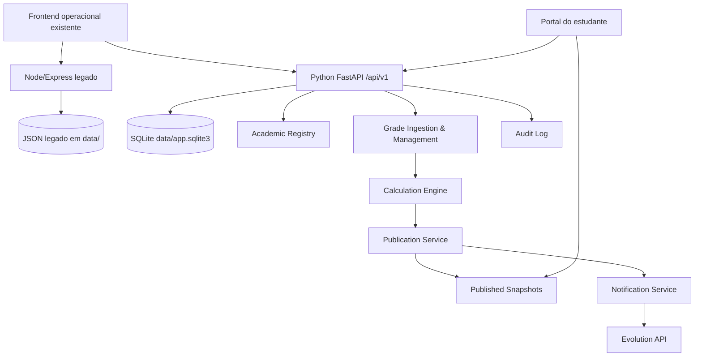

# Arquitectura de Componentes

## Componentes Novos

### Backend Python API

**Responsabilidade:** expor API académica, autenticação, gestão de contexto, notas, publicação e portal.

**Interfaces-chave:**
- `/api/v1/auth/*`
- `/api/v1/academic-contexts/*`
- `/api/v1/students/*`
- `/api/v1/imports/*`
- `/api/v1/grades/*`
- `/api/v1/publications/*`
- `/api/v1/portal/*`

**Dependências:** SQLite, Alembic, Evolution adapter e frontend.

### Academic Registry

**Responsabilidade:** gerir semestres, turnos, turmas, cursos, disciplinas, alocações docentes e matrículas.

**Interfaces-chave:** criação/listagem de contextos e validação de escopo do professor.

**Dependências:** autenticação e DB.

### Grade Ingestion and Management

**Responsabilidade:** importar ficheiros, validar linhas, associar notas a contexto académico e permitir correcção manual.

**Interfaces-chave:** importação por contexto, relatório de erros, edição controlada.

**Dependências:** registry, audit log e calculation engine.

### Calculation Engine

**Responsabilidade:** calcular resultados internos com fórmula versionada e configurável.

**Interfaces-chave:** recalcular por contexto, guardar `formula_version`, devolver estado interno.

**Dependências:** grade entries e assessment definitions.

### Publication Service

**Responsabilidade:** transformar dados internos em snapshots publicados após acção explícita de broadcast.

**Interfaces-chave:** criar broadcast, gerar snapshots, marcar versão actual, suportar re-publicação.

**Dependências:** calculation engine, notification service e audit log.

### Notification Service

**Responsabilidade:** enviar WhatsApp via Evolution API e preparar e-mail futuro sem acoplar domínio à API externa.

**Interfaces-chave:** `send_whatsapp`, `record_delivery`, `retry_delivery`.

**Dependências:** Evolution API, broadcast jobs.

### Student Portal Read Model

**Responsabilidade:** disponibilizar apenas snapshots actuais publicados por número de estudante autenticado.

**Interfaces-chave:** resumo do estudante, notas publicadas, calendário publicado.

**Dependências:** auth e tabelas de snapshots.

## Diagrama de Interacção

