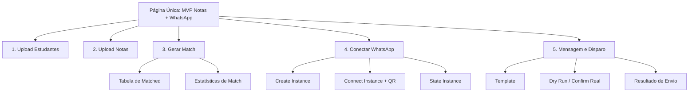
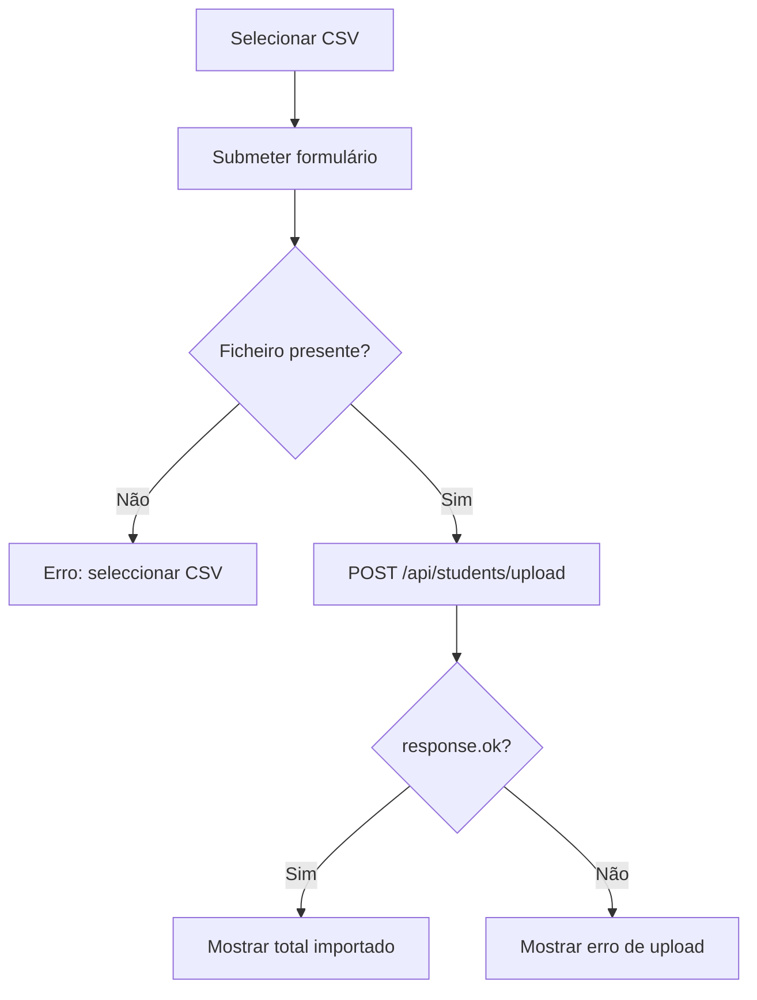
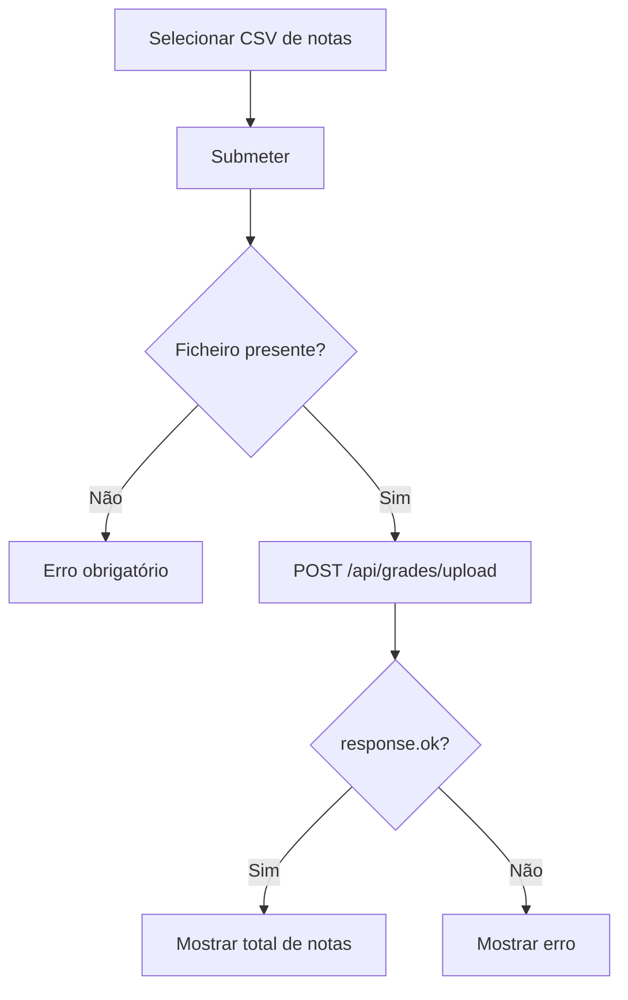
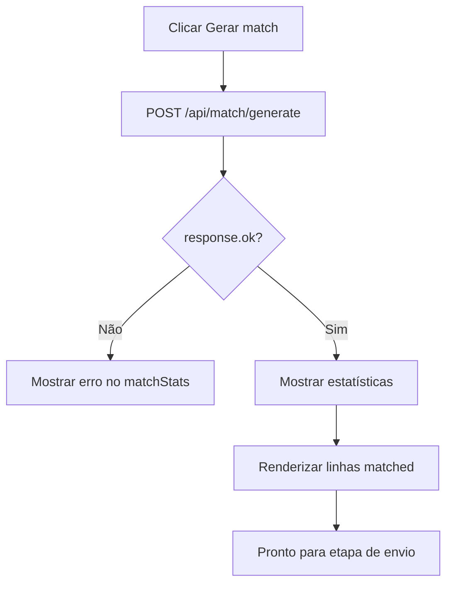
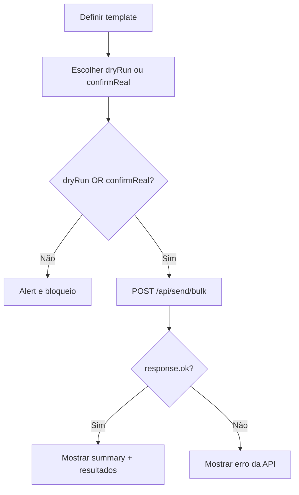

# Planilha de Notas de Alunos UI/UX Specification

## Introduction
Este documento define metas de experiência, arquitectura de informação, fluxos críticos e especificações visuais para a interface do projecto **Planilha de Notas de Alunos**, com foco operacional no fluxo real já implementado: **upload de estudantes → upload de notas → geração de match → envio em massa via WhatsApp**. O objectivo é reduzir fricção operacional para docentes, aumentar previsibilidade de estados da interface e elevar consistência visual, acessibilidade e responsividade.

### Overall UX Goals & Principles

#### Target User Personas
- **Docente Operacional (primário):** precisa executar rapidamente o ciclo upload→match→envio, com baixa tolerância a erros e pouco tempo para configuração manual.
- **Coordenador Pedagógico (secundário):** precisa de confiança no resultado agregado (totais, falhas, inconsistências) para supervisão.
- **Utilizador Técnico de Suporte (secundário):** valida integração com Evolution API e diagnostica falhas de conexão/envio.

#### Usability Goals
- **Eficiência:** utilizador deve completar o fluxo principal em menos de 5 minutos com ficheiros válidos.
- **Prevenção de erro:** interface deve bloquear envio real sem confirmação explícita e sem dados de match.
- **Feedback imediato:** cada acção deve retornar estado visível (loading, sucesso, erro) sem ambiguidade.
- **Confiabilidade percebida:** utilizador deve entender claramente o que foi processado, o que falhou e o que ainda está pendente.

#### Design Principles
1. **Clareza sobre densidade:** reduzir carga cognitiva por secção, com hierarquia explícita de estados.
2. **Fluxo guiado:** evidenciar pré-condições entre etapas (não incentivar “Disparar” antes de “Gerar match”).
3. **Consistência semântica:** sucesso, aviso e erro com padrões visuais unificados.
4. **Acessibilidade por defeito:** foco, contraste, labels e semântica correctos em todos os controlos.
5. **Mobile pragmático:** garantir usabilidade total em viewport estreita para operação em campo.

### Change Log
| Date | Version | Description | Author |
|---|---|---|---|
| 2026-04-26 | 1.0 | Especificação inicial com foco em inconsistências visuais, a11y, responsividade e fluxo upload→match→envio | UX-Design Expert |

## Information Architecture (IA)

### Site Map / Screen Inventory

### Navigation Structure
**Primary Navigation:** sequência linear em secções verticais numeradas (1–5) na mesma página.

**Secondary Navigation:** inexistente actualmente; recomenda-se adição de mini sumário fixo com âncoras por secção para reduzir scroll e facilitar retorno.

**Breadcrumb Strategy:** não aplicável para single-page; substituir por indicador de progresso do fluxo.

## User Flows

### Fluxo 1 — Upload de Estudantes
**User Goal:** importar base de estudantes para posterior matching.

**Entry Points:** secção “1) Upload de estudantes (CSV)”.

**Success Criteria:** status confirma total importado e ficheiro passa para estado “carregado”.

#### Flow Diagram

#### Edge Cases & Error Handling:
- CSV vazio ou sem colunas mínimas.
- Upload repetido substitui base anterior sem confirmação explícita.
- Estado de sucesso/erro sem semântica visual diferenciada.

### Fluxo 2 — Upload de Notas
**User Goal:** importar notas para gerar correspondência com estudantes.

**Entry Points:** secção “2) Upload de notas (CSV)”.

**Success Criteria:** total de notas importadas exibido sem ambiguidade.

#### Flow Diagram

#### Edge Cases & Error Handling:
- Notas normalizadas sem validação de faixa exibida ao utilizador.
- Ausência de aviso quando total importado é 0.

### Fluxo 3 — Gerar Match
**User Goal:** produzir lista consolidada de estudantes com nota e WhatsApp válido para envio.

**Entry Points:** botão “Gerar match”.

**Success Criteria:** estatísticas e tabela actualizadas com matched/unmatched/invalidPhones.

#### Flow Diagram

#### Edge Cases & Error Handling:
- Botão activo mesmo sem uploads prévios.
- Tabela limpa antes da resposta; falha pode deixar utilizador sem contexto prévio.

### Fluxo 4 — Envio em Massa
**User Goal:** enviar ou simular mensagens para alunos com match válido.

**Entry Points:** secção “5) Mensagem e disparo”.

**Success Criteria:** payload final com summary e resultados por destinatário.

#### Flow Diagram

#### Edge Cases & Error Handling:
- Não há prevenção visual para envio sem match gerado recentemente.
- Falha de rede não distingue erro transitório de erro de dados.

## Wireframes & Mockups

**Primary Design Files:** a definir (recomendado Figma com frames Desktop 1280 e Mobile 390).

### Key Screen Layouts

#### Screen: Página operacional única (Desktop)
**Purpose:** executar o ciclo completo com leitura rápida de estados.

**Key Elements:**
- Barra de progresso de 5 etapas (com estado actual).
- Cartões de etapa com header, acção primária e status semântico.
- Painel de resultados consolidado (match + envio).

**Interaction Notes:** botões de etapas futuras ficam desactivados até pré-condições mínimas.

**Design File Reference:** a definir.

#### Screen: Página operacional única (Mobile)
**Purpose:** permitir operação essencial em ecrã reduzido sem perda de controlo.

**Key Elements:**
- Cards empilhados com CTA full-width.
- Tabela de match adaptada para cards por aluno.
- Zona fixa inferior para acção principal da etapa activa.

**Interaction Notes:** reduzir texto técnico exposto por defeito e usar expansão “ver detalhes”.

**Design File Reference:** a definir.

## Component Library / Design System

**Design System Approach:** sistema mínimo baseado em tokens CSS (cores, espaçamento, tipografia, radius) com componentes atómicos reutilizáveis.

### Core Components

#### Component: Button
**Purpose:** acções primárias e secundárias por etapa.

**Variants:** primary, secondary, danger, ghost, disabled, loading.

**States:** default, hover, focus-visible, active, disabled, loading.

**Usage Guidelines:** CTA principal por card usa primary; acções técnicas (estado/refresh) usam secondary.

#### Component: StatusMessage
**Purpose:** feedback de acção ao utilizador.

**Variants:** success, info, warning, error.

**States:** inline, dismissible, persistent.

**Usage Guidelines:** substituir `
` neutros por blocos com ícone, contraste AA e role ARIA apropriado.

#### Component: StepCard
**Purpose:** agrupar etapa funcional com pré-condições e acção.

**Variants:** locked, active, completed, error.

**States:** collapsed, expanded.

**Usage Guidelines:** expor claramente “o que falta” para desbloquear etapa seguinte.

#### Component: MatchDataView
**Purpose:** apresentar resultados de match com legibilidade.

**Variants:** table-desktop, cards-mobile.

**States:** loading, empty, populated, error.

**Usage Guidelines:** nunca limpar contexto anterior sem confirmação de novo resultado válido.

## Branding & Style Guide

### Visual Identity
**Brand Guidelines:** não definidas; adoptar estilo funcional, neutro e orientado a produtividade.

### Color Palette
| Color Type | Hex Code                              | Usage                                     |
| ---------- | ------------------------------------- | ----------------------------------------- |
| Primary    | #0D6EFD                               | Botões e destaques principais             |
| Secondary  | #475569                               | Acções secundárias e texto de suporte     |
| Accent     | #14B8A6                               | Destaques informacionais não críticos     |
| Success    | #15803D                               | Confirmações e estados concluídos         |
| Warning    | #B45309                               | Alertas e estados pendentes               |
| Error      | #B91C1C                               | Erros de validação e falhas de integração |
| Neutral    | #0F172A / #334155 / #CBD5E1 / #F8FAFC | Texto, bordas e fundos                    |

### Typography
#### Font Families
- **Primary:** Inter, system-ui, sans-serif
- **Secondary:** Inter, system-ui, sans-serif
- **Monospace:** ui-monospace, SFMono-Regular, Menlo, monospace

#### Type Scale
| Element | Size | Weight | Line Height |
|---|---|---|---|
| H1 | 32px | 700 | 40px |
| H2 | 24px | 600 | 32px |
| H3 | 20px | 600 | 28px |
| Body | 16px | 400 | 24px |
| Small | 14px | 400 | 20px |

### Iconography
**Icon Library:** Heroicons ou Lucide.

**Usage Guidelines:** ícones apenas para reforço semântico de estado, nunca como único meio de comunicação.

### Spacing & Layout
**Grid System:** 12 colunas no desktop; 4 colunas no mobile.

**Spacing Scale:** 4, 8, 12, 16, 24, 32, 40, 48.

## Accessibility Requirements

### Compliance Target
**Standard:** WCAG 2.2 AA.

### Key Requirements
**Visual:**
- Color contrast ratios: texto normal ≥ 4.5:1; UI components/focus ≥ 3:1.
- Focus indicators: `:focus-visible` com anel de alto contraste em todos os elementos interactivos.
- Text sizing: suportar zoom browser até 200% sem perda funcional.

**Interaction:**
- Keyboard navigation: ordem de tab lógica por etapas e activação por teclado em todos os botões.
- Screen reader support: labels explícitas para inputs de ficheiro e anúncio de estados em regiões `aria-live`.
- Touch targets: mínimo de 44x44 px para controlos tácteis.

**Content:**
- Alternative text: QR mantém `alt` descritivo dinâmico quando visível.
- Heading structure: manter sequência hierárquica sem saltos semânticos.
- Form labels: substituir placeholders implícitos por `<label for>` em todos os campos.

### Testing Strategy
- Auditoria automática com Lighthouse e axe-core por breakpoint.
- Testes manuais de teclado (Tab/Shift+Tab/Enter/Esc).
- Validação com NVDA/VoiceOver para estados críticos (upload, erro, envio).

## Responsiveness Strategy

### Breakpoints
| Breakpoint | Min Width | Max Width | Target Devices |
|---|---|---|---|
| Mobile | 320px | 767px | Smartphones |
| Tablet | 768px | 1023px | Tablets portrait/landscape |
| Desktop | 1024px | 1439px | Laptops e desktops comuns |
| Wide | 1440px | - | Monitores largos |

### Adaptation Patterns
**Layout Changes:** transformar secções em StepCards com cabeçalho fixo e conteúdo expansível.

**Navigation Changes:** adicionar sumário de etapas sticky no topo (desktop) e menu compacto (mobile).

**Content Priority:** priorizar acção + estado; detalhes técnicos em “expandir”.

**Interaction Changes:** botões full-width no mobile; tabela converte para lista de cards com campos-chave.

## Animation & Micro-interactions

### Motion Principles
Movimento curto e funcional, evitando ornamento excessivo; prioridade para feedback de sistema.

### Key Animations
- **Step transition:** expansão/recolha de card activo (Duration: 180ms, Easing: ease-out)
- **Status appear:** fade/slide curto para mensagens de estado (Duration: 150ms, Easing: ease-out)
- **Loading affordance:** shimmer/skeleton discreto em tabela e resultados (Duration: 800ms loop, Easing: linear)

## Performance Considerations

### Performance Goals
- **Page Load:** < 2s em rede 4G padrão.
- **Interaction Response:** < 100ms para interacções locais.
- **Animation FPS:** alvo de 60fps em hardware médio.

### Design Strategies
- Evitar renderizações desnecessárias de tabela completa em actualizações pequenas.
- Reutilizar classes/tokens para reduzir CSS redundante.
- Limitar pintura complexa em mobile (sombras e efeitos custosos).

## Diagnóstico de inconsistências actuais (baseado no código)

### Inconsistências visuais detectadas
- Falta de sistema semântico de estados: mensagens usam `
` e `<pre>` sem distinção consistente de sucesso/erro (`public/index.html:18`, `public/index.html:27`, `public/index.html:57`, `public/index.html:73`).
- Botões partilham estilo único, sem hierarquia visual para acções destrutivas/críticas (`public/styles.css:25-36`).
- Layout global rígido para desktop com pouca adaptação explícita para ecrãs pequenos (`public/styles.css:6-12`, `public/styles.css:43-50`).

### Lacunas de acessibilidade detectadas
- Inputs de ficheiro sem `<label>` associado (`public/index.html:15`, `public/index.html:24`).
- Feedback dinâmico não anunciado por tecnologias assistivas (ausência de `aria-live` nas áreas de status).
- Uso de `alert()` para bloqueio de confirmação no envio, com experiência frágil para leitores de ecrã (`public/app.js:182`).

### Lacunas de responsividade detectadas
- Tabela apenas com `overflow-x:auto`; sem versão optimizada por cards em mobile (`public/styles.css:43-57`).
- Falta de breakpoints explícitos e de padrões adaptativos por etapa.

### Lacunas de fluxo detectadas (upload→match→envio)
- Etapas não são guiadas por estados de prontidão; utilizador pode accionar operações fora de sequência.
- “Disparar em massa” depende de match anterior, mas a UI não torna essa dependência explícita.
- “Gerar match” limpa tabela antes de sucesso, podendo ocultar dados úteis em caso de falha (`public/app.js:66`).

## Next Steps

### Immediate Actions
1. Introduzir arquitectura visual por StepCard com estados locked/active/completed/error.
2. Implementar componentes `StatusMessage` com semântica ARIA e tokenização de cor.
3. Corrigir semântica de formulários (labels, aria-describedby, aria-live).
4. Criar adaptação mobile para resultados de match em cards.
5. Bloquear/activar CTA por pré-condições de fluxo.
6. Executar auditoria a11y automática + manual e fechar não conformidades críticas.

### Design Handoff Checklist
- [x] All user flows documented
- [x] Component inventory complete
- [x] Accessibility requirements defined
- [x] Responsive strategy clear
- [x] Brand guidelines incorporated
- [x] Performance goals established

## Checklist Results
Checklist de UX aplicado manualmente a partir da situação actual do projecto:
- Fluxos críticos: **cobertos**
- Estados de erro/sucesso: **parcial** (necessita padronização)
- Acessibilidade base: **insuficiente** (labels/aria/foco)
- Responsividade: **parcial** (necessita estratégia por breakpoint)
- Prontidão para handoff frontend: **apto com acções prioritárias implementadas**
