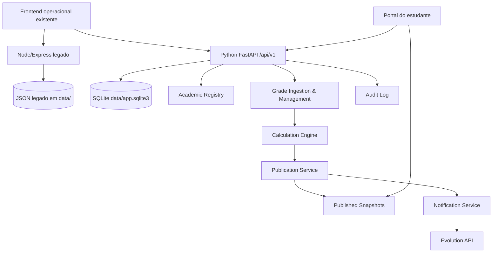

**UNIVERSIDADE LUSÍADA DE ANGOLA**

**FACULDADE DE CIÊNCIA E TECNOLOGIA**

**CURSO DE ENGENHARIA INFORMÁTICA — 1º ANO | GRUPO 3**

**TÍTULO DO SISTEMA: PLATAFORMA ACADÉMICA DE NOTAS**

Relatório Técnico (Norma APA 7.ª Edição)

Autor(a): Credo Lopes
Número de Estudante: —
Orientador(a): —
Local: Angola
Ano: 2026

# Resumo
Este relatório descreve a construção e validação de uma Plataforma Académica de Notas, com persistência académica em base de dados, publicação controlada e consulta por estudantes. O sistema suporta operações do professor (gestão de contextos, importação/edição de notas e preparação de broadcast), um portal do estudante baseado em snapshots publicados e integra-se com a Evolution API para comunicação via WhatsApp. A metodologia de desenvolvimento seguiu um ciclo story-driven, com validação e gates de qualidade, incluindo testes automatizados (pytest) e verificações de consistência do fluxo crítico de upload → cálculo → publicação.

# Abstract
This report presents the development and validation of an Academic Notes Platform with relational persistence, controlled publication, and student-facing consultation. The system enables professor operations for context management, grade import/correction, and explicit broadcast preparation, while providing a student portal based on published snapshots. It also integrates with the Evolution API for WhatsApp notifications. Development followed a story-driven workflow with quality gates, including automated testing (pytest) and checks to preserve the critical upload → calculation → publication flow.

# 1. Introdução
O acompanhamento académico exige mecanismos fiáveis para a gestão de notas, sincronização entre professores e estudantes e divulgação segura de resultados. Em abordagens iniciais baseadas em ficheiros e fluxos simplificados, surgem limitações relacionadas com integridade de dados, auditabilidade e consistência entre valores internos e valores publicados.

Neste projecto, a solução visa substituir a persistência em ficheiros JSON por uma base de dados relacional (SQLite) e consolidar a publicação de notas num modelo explícito de broadcast. Assim, apenas snapshots publicados ficam acessíveis ao estudante, preservando o controlo do professor sobre o estado académico exposto.

# 1.1 Objetivo Geral
Desenvolver uma Plataforma Académica de Notas que permita a gestão de estudantes, contextos académicos, importação/correção de notas, cálculo de estado académico, publicação controlada e consulta por estudantes, garantindo segurança, auditabilidade e validação por testes.

# 1.2 Objetivos Específicos
1. Modelar o domínio académico em persistência relacional (semestres, turnos, turmas, disciplinas, cursos, alocações e matrículas).
2. Implementar importação estruturada de notas com validação e gestão de erros.
3. Calcular resultados académicos com base em fórmula institucional versionada e configurável.
4. Implementar serviço de publicação que gera snapshots publicados após ação explícita de broadcast.
5. Disponibilizar portal do estudante com autenticação e consulta restrita a dados publicados.
6. Integrar comunicação via WhatsApp através da Evolution API, preservando rate limiting e segurança de fluxo.

# 1.3 Metodologia
A metodologia combinou documentação de arquitectura e requisitos (PRD) com desenvolvimento orientado por stories e gates. O ciclo story-driven incluiu: criação/validação (checklist estruturado), implementação e QA gate com critérios de segurança, testes, regressões e documentação. O desenvolvimento foi conduzido de forma incremental para preservar capacidades existentes do fluxo crítico, com substituição controlada por migração para o modelo alvo.

# 2. Apresentação do Sistema
A Plataforma Académica de Notas fornece três papéis principais:
- **Professor**: gere contextos académicos, importa/edita notas, prepara e executa broadcast/publicação.
- **Delegado**: opera com permissões técnicas limitadas à turma/contexto atribuído, sem capacidade de alterar notas publicadas sem validação.
- **Estudante**: autentica-se e consulta apenas snapshots publicados do seu estado académico, incluindo dados e calendário de provas.

O fluxo operacional central é:
1. Importação/edição de dados pelo professor.
2. Cálculo de estado académico com base nos componentes de avaliação.
3. Execução de broadcast para criar snapshots publicados.
4. Portal do estudante passa a exibir apenas a versão publicada actual.

# 3. Arquitetura do Sistema
A arquitectura alvo foi definida para consolidar persistência relacional em SQLite e uma API web em Python (FastAPI), mantendo integrações existentes por migração controlada.

## 3.1 Módulos e componentes
A arquitectura de componentes (visão alvo) inclui:
- **identity**: autenticação e sessão, com troca obrigatória de palavra-passe no primeiro acesso.
- **academic-registry**: semestres, turnos, turmas, cursos e alocações.
- **student-registry**: registo académico do estudante, contactos e associação a contextos.
- **grade-ingestion**: importação e validação de ficheiros de notas.
- **grade-management**: edição manual e correcções controladas.
- **calculation-engine**: cálculo de estado interno com fórmula versionada.
- **publication-service**: snapshots publicados após broadcast.
- **notification-service**: envio via WhatsApp (Evolution API) e preparação futura de e-mail.
- **audit-log**: rastreio de uploads, edições, broadcasts e aprovações.
- **student portal read model**: consulta restrita a snapshots publicados.

## 3.2 Diagrama de interacção

## 3.3 Estratégia de migração e consistência
O projecto descreve coexistência controlada entre runtime e persistência. Ficheiros JSON legados podem ser usados como artefacto transitório ou cache, mas o modelo alvo define base de dados relacional como fonte de verdade. A publicação permanece dependente de ação humana explícita, sem automação silenciosa.

# 4. Requisitos do Sistema
Os requisitos funcionais (FR) e não funcionais (NFR) foram definidos em `docs/prd/requisitos.md`, incluindo capacidades como gestão de contextos, upload e correção de notas, distinção entre dados internos e publicados, e chatbot para perguntas sobre notas publicadas.

## 4.1 Requisitos Funcionais
O sistema implementa, entre outros, os seguintes requisitos:
- preservação do fluxo crítico existente até substituição validada (FR1),
- configuração e gestão de semestres/turmas/turnos/disciplinas/cursos (FR2),
- associação de estudantes aos contextos e gestão por número de estudante (FR4),
- upload/importação de notas por ficheiros estruturados (FR5),
- correção manual e completamento de notas (FR6),
- cálculo de resultados com fórmula configurável, mantendo fórmula oficial pendente (FR7),
- visibilidade ao estudante baseada em dados publicados (FR8, FR9 e FR10).

Além disso, o sistema suportou integração WhatsApp como canal principal para broadcast (FR11), portal do estudante para consulta (FR12), autenticação e troca obrigatória de palavra-passe no primeiro acesso (FR13), e perfil de delegado com permissões limitadas (FR14 e FR15).

## 4.2 Requisitos Não Funcionais
Os requisitos não funcionais incluem:
- persistência relacional como fonte de verdade (NFR1),
- uso de Python como motor central, com transição controlada (NFR2),
- proteção de acesso por autenticação/autorizações (NFR3),
- suporte a evolução futura de fórmulas e regras sem reescrita estrutural (NFR4),
- qualidade verificável via lint/typecheck/testes (NFR5),
- acessibilidade WCAG 2.2 AA (NFR6),
- feedback claro e prevenção de ações fora de sequência (NFR7),
- portal exibe apenas a versão publicada actual (NFR8).

# 5. Tecnologias Utilizadas
O projecto utiliza tecnologias alinhadas com a arquitectura descrita e com o PRD:
- **Python 3.12+** e **FastAPI** para a API e serviços.
- **SQLite** como base de dados relacional e **Alembic** para migrações.
- **SQLAlchemy 2.x** para modelação e acesso a dados.
- **Pydantic 2** para validação e serialização.
- **Argon2id** para armazenamento seguro de hashes de palavra-passe.
- **React 18**, **Vite** e **TypeScript** no frontend, incluindo estilo com **Tailwind** e componentes como shadcn/ui.
- Integração de notificações via **Evolution API** para WhatsApp.
- Motor de IA para interpretação de mensagens via provedor **DeepSeek Chat** (OpenAI-compatible), com arquitetura de provider e rate limiting no fluxo.
- Testes em **pytest** e verificação de qualidade em **ruff/mypy** e scripts equivalentes.

# 6. Implementação
A implementação seguiu épicos e stories, com gates de QA. Foram executadas fases de base (bootstrap e persistência), autenticação e papéis, gestão académica e publicação, e por fim integração do chatbot para perguntas em linguagem natural sobre notas publicadas.

## 6.1 Execução por épicos
- **Epic 5 (Academic Platform Foundation)**: base de backend Python, modelo académico e portal de leitura.
- **Epic 6 (AI WhatsApp Chatbot)**: webhook WhatsApp via Evolution API, serviço de IA para interpretar perguntas e responder com base em dados publicados.
- **Epic 7 (Frontend académico)**: páginas essenciais do professor, gestão de notas e portal do estudante, incluindo vista de delegado read-only.
- **Epic 8 (Production Cutover)**: cutover e validação de transição para a arquitectura alvo.
- **Epic 9 (Real Evolution Acceptance)**: aceitação e testes finais, incluindo switch de provedor para DeepSeek.

## 6.2 Validação automática e regressões
A validação do projecto incluiu execução de testes automatizados. No estado actual do repositório, os testes pytest executados reportam **170/170** passando (com warnings não bloqueantes). O projecto também definiu gates por história e QA, garantindo cobertura dos critérios de aceitação e preservação do comportamento do fluxo crítico.

# 7. Segurança e Proteção de Dados
A segurança alvo baseia-se em autenticação/autorizações diferenciadas por papéis e em controlo de acesso a dados e operações sensíveis.

## 7.1 Modelo de segurança
- **Argon2id** para armazenamento de hashes.
- Cookies com **HttpOnly** e controlo de expiração.
- Troca obrigatória de palavra-passe no primeiro acesso.
- Rate limiting para endpoints críticos, incluindo login e broadcast.
- Restrições de resposta no chatbot para não expor notas não publicadas.

## 7.2 Delegado e controlo de permissões
O delegado opera como estudante com permissões técnicas adicionais quando existir atribuição activa. O modelo define que o delegado não deve editar notas directamente, não deve remover turmas nem executar acções sensíveis sem validação do professor, mantendo rastreio via auditoria.

# 8. Testes e Resultados
Os resultados de qualidade foram verificados por gates e por execução local de testes. O projecto mantém um conjunto de testes automatizados em pytest e usa verificações complementares como lint/typecheck para manter consistência e evitar regressões.

## 8.1 Evidências de execução
- **pytest**: 170/170 passando em execução reportada.
- **Gates QA**: QA gates por story com verificação de critérios, incluindo testes e segurança.

# 9. Benefícios e Limitações
## 9.1 Benefícios
1. Persistência relacional como fonte de verdade.
2. Publicação controlada por broadcast com snapshots.
3. Portal do estudante limitado ao estado publicado.
4. Auditabilidade de operações sensíveis.
5. Integração via WhatsApp com rate limiting.
6. Chatbot com recusa de respostas sobre dados não publicados.
7. Arquitectura modular com serviços especializados.
8. Testes automatizados e gates de qualidade.
9. Autenticação e segurança com Argon2id.
10. Evolução do provedor de IA via arquitectura de provider.

## 9.2 Limitações
- A fórmula institucional oficial de cálculo permanece pendente de validação formal, sendo suportada por um modelo versionado e configurável.
- A transição brownfield pode introduzir complexidade temporária entre runtime e persistência.
- Restrições funcionais decorrentes do modelo de segurança e auditoria exigem cuidado operacional em permissões do delegado.

# 10. Conclusão
O projecto atingiu o objectivo de construir uma Plataforma Académica de Notas com persistência relacional, publicação controlada e consulta segura por estudantes. A implementação preservou o fluxo crítico existente e evoluiu o sistema para um modelo arquitectural consistente, com validação por story-driven development e QA gates.

Como trabalhos futuros, recomenda-se a consolidação da fórmula oficial de cálculo e a ampliação de validações e testes adicionais para cobrir casos de borda de cálculo e publicação.

# Referências
- Documentação interna do projecto: `docs/prd/requisitos.md`.
- Documentação interna do projecto: `docs/architecture/system-architecture.md`.
- Documentação interna do projecto: `docs/architecture/arquitectura-de-componentes.md`.
- Documentação interna do projecto: `docs/architecture/segurana.md`.
- Artefactos de desenvolvimento do projecto: stories e gates em `docs/stories/` e `docs/qa/gates/`.
- Repositório do projecto: estrutura e configuração em `pyproject.toml`.
